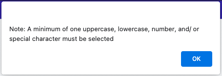
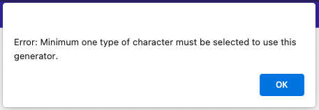
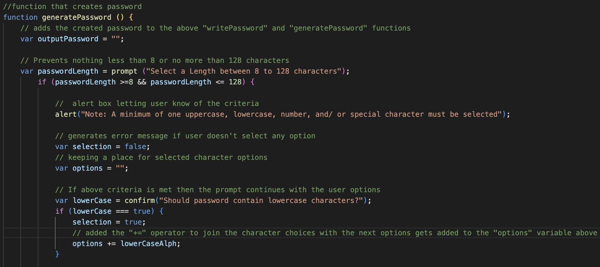

# Secure Password Generator

## Description

[Link to deployed site] (https://jonnyboy808.github.io/secure-password-generator/)

This site makes for an easier alternative to creating a secure and strong password. In todays world, too much of our sensitive information is secured usually by a password we created mentally that may be too easy to guess. This secure password generator helps create that, allowing the user to select their desired amount of length, number, special, uppercase or lowercase characters. With each click of the generate password button, a new and completely random password is created. This prevents from the same password to be used. It is especially good to keep passwords separated to create higher security with each application that it gets used with. The user can than copy that password and use it for an application of their liking.

## Installation

No type of installation needed for this application, simply visit the above link and follow the prompts to generate a new password.

## Usage

This site contains a password generator to help the user create a password with their desired length between 8 to 128 characters. Shortly after the user selects their desired password length a message pops up letting the user know of the minimum requirement that is needed inorder to use this generator and populate a finished generated password.  

 This generator does require the password to at least contain one type of character, and should the user not select any at all, an error box will appear noting that.

---
Below is an example screenshot of the created function that generates a password based on the users inputs of their desired character choices. Should the user select a minimum of one type of character, than the generated characters is displayed within the generated password field.

Enjoy the final product!

## Credits

N/A

## License

No license at this time

---
